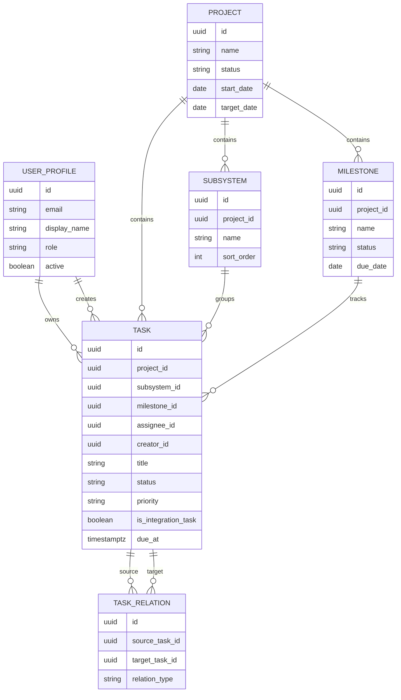

# 机器人竞赛团队在线任务看板设计说明

## 当前实现状态

截至当前仓库版本，下面这些设计已经落地为可运行 MVP：

- 独立账号登录与管理员权限边界
- 我的任务首页
- 项目列表与项目看板
- 任务创建、编辑、状态流转
- 管理员维护成员、项目、子系统、里程碑

当前剩余工作以文档完善、部署说明和更完整自动化验证为主，不再是核心业务缺口。

## 1. 目标

为 6-8 人机器人竞赛团队提供一个内部使用的简易在线任务看板，用于管理多项目、多模块、多技术组协同下的任务推进、里程碑进度与阻塞项。

系统首版重点解决三个问题：

- 每个人登录后能立刻看到自己当前要做什么
- 项目管理者能按机器人/模块查看整体推进情况
- 跨技术组协作能够通过关联任务和联调任务清晰落地

## 2. 已确认决策

- 使用范围：仅团队内部成员使用
- 部署方式：公网访问，基础安全与低运维优先
- 账号模型：每个成员独立账号，唯一管理员账号
- 项目模型：支持多个项目/多个比赛模块
- 组织方式：采用“按项目组织，子系统承载任务”
- 协作方式：跨组工作拆分为多条关联任务，并单独设置联调任务
- 任务状态：待开始 / 进行中 / 阻塞 / 已完成
- 登录后首页：我的任务
- 普通成员权限：可创建任务，但项目/里程碑由管理员维护

## 3. 设计原则

- 以交付对象为中心，而不是以技术组为中心
- 一个任务只保留一个主负责人，保证责任清晰
- 通过关联任务表达协作，通过联调任务表达集成阶段
- 保持 MVP 边界，避免做成重型项目管理系统
- 优先使用托管服务降低运维与安全负担

## 4. 信息架构

### 4.1 核心层级

- 项目：一个机器人、一个比赛专项、一个独立平台模块
- 子系统：项目下的功能域，如底盘、云台、视觉、通信、电源、上位机
- 里程碑：项目阶段性交付目标，如“完成第一次全车联调”
- 任务：最小执行单元，属于某个项目和某个子系统，可选关联里程碑
- 标签：技术组、优先级、阻塞、联调等筛选维度

### 4.2 为什么不用技术组做主层级

机械、电控、算法、嵌入式、软开属于人员分工，不是交付对象。如果按技术组组织看板，跨组协作会被拆散，联调问题也难以落到具体机器人或模块上。按项目与子系统组织，可以同时满足执行视角和管理视角。

## 5. 角色与权限

### 5.1 管理员

- 创建、编辑项目
- 创建、编辑子系统
- 创建、编辑里程碑
- 创建成员账号、重置密码、禁用账号
- 查看并编辑所有任务
- 查看全局筛选结果和全局阻塞项

### 5.2 普通成员

- 登录并查看自己的任务首页
- 在已有项目和子系统下创建任务
- 修改自己创建的任务
- 更新自己负责任务的状态
- 查看项目看板和里程碑进度
- 不可创建项目、子系统、里程碑
- 不可删除任务，只能关闭或归档，由管理员统一清理

## 6. 核心对象定义

### 6.1 项目 Project

- 名称
- 简述
- 状态：规划中 / 进行中 / 已归档
- 开始日期
- 目标结束日期

### 6.2 子系统 Subsystem

- 所属项目
- 名称
- 描述
- 排序

### 6.3 里程碑 Milestone

- 所属项目
- 名称
- 目标日期
- 状态：未开始 / 进行中 / 已完成
- 说明

### 6.4 任务 Task

- 标题
- 描述
- 项目
- 子系统
- 可选里程碑
- 主负责人
- 创建人
- 状态：待开始 / 进行中 / 阻塞 / 已完成
- 优先级：低 / 中 / 高 / 紧急
- 截止时间
- 技术组标签
- 是否联调任务
- 阻塞原因
- 完成时间

### 6.5 任务关联 Task Relation

- 当前任务
- 目标任务
- 关系类型：依赖 / 关联 / 联调输入

## 7. 页面设计

### 7.1 登录页

- 支持邮箱与密码登录
- 管理员在后台创建成员账号并设置初始密码
- 首版关闭邮箱验证，减少操作成本
- 成员首次登录后可修改密码

### 7.2 我的任务

这是成员登录后的默认首页。

包含以下模块：

- 我的任务看板：按状态分为四列
- 即将到期任务：未来 3 天内到期
- 阻塞任务提醒：列出自己当前阻塞项
- 我参与的里程碑：展示本人任务关联的里程碑

设计要求：

- 桌面端优先使用四列卡片布局
- 移动端改为分段列表，不做复杂拖拽
- 状态更新使用按钮或下拉菜单，MVP 不实现拖拽

### 7.3 项目列表页

- 显示所有项目卡片
- 每个项目展示项目状态、里程碑数量、未完成任务数、阻塞任务数
- 支持按项目状态筛选

### 7.4 项目看板页

进入单个项目后，展示：

- 项目概览
- 里程碑列表与完成度
- 任务看板
- 子系统筛选
- 负责人筛选
- 状态筛选
- 优先级筛选
- 联调任务高亮
- 阻塞任务高亮

### 7.5 管理页

管理员专用，包含：

- 用户管理
- 项目管理
- 子系统管理
- 里程碑管理
- 全局任务检索

## 8. 关键业务流程

### 8.1 创建项目结构

1. 管理员创建项目
2. 管理员为项目创建子系统
3. 管理员为项目设置里程碑

### 8.2 创建任务

1. 成员进入某个项目
2. 选择子系统
3. 创建任务并指定主负责人、优先级、截止时间
4. 可选关联里程碑
5. 如为联调任务，勾选联调标记

### 8.3 跨组协作

对于“一个功能需要多个技术组共同完成”的情况，不创建多人共担的大任务，而是采用：

- 每个技术组或负责人创建一条明确任务
- 通过任务关联表达依赖或配合关系
- 再额外创建一条联调任务，作为集成收口

### 8.4 日常使用

- 成员每天进入“我的任务”更新状态
- 管理员从项目页查看里程碑和阻塞项
- 开会时优先关注联调任务与阻塞任务

## 9. 推荐技术方案

## 9.1 方案结论

推荐使用：

- 前端：Next.js
- 样式：Tailwind CSS
- 鉴权与数据库：Supabase
- 部署：Vercel

原因：

- 鉴权、数据库、公网部署都能快速落地
- 不需要自行维护服务器、数据库和会话系统
- 后续扩展评论、通知、统计时成本较低

## 9.2 登录与安全策略

- 使用 Supabase Auth 的邮箱密码登录
- 关闭邮箱确认
- 管理员通过后台创建成员账号
- 普通成员只能访问登录后的页面
- 关键写操作全部在服务端执行
- 数据库启用 RLS，只允许认证用户访问数据

这不是企业级安全模型，但对于学生团队内部系统已足够稳妥。

## 10. 数据模型草案

## 11. MVP 范围

### 11.1 首版必须包含

- 成员登录
- 我的任务首页
- 项目列表页
- 项目看板页
- 管理员管理项目、子系统、里程碑、用户
- 创建和编辑任务
- 更新任务状态
- 按项目、子系统、负责人、状态、优先级筛选
- 联调任务与阻塞任务高亮

### 11.2 首版明确不做

- 评论
- 文件附件
- 通知提醒
- 工时统计
- 甘特图
- 多管理员
- 复杂审批
- 外部访客

## 12. 成功标准

- 每个成员能在 30 秒内找到自己当前待办
- 管理员能在 1 分钟内定位某个项目的阻塞项
- 跨组协作项能明确拆分为多条责任清晰的任务
- 里程碑下的未完成任务可以被快速追踪
- 首版系统可稳定支撑 6-8 人团队日常使用

## 13. 后续扩展方向

在 MVP 跑顺后，再考虑：

- 评论与任务历史
- 到期提醒
- 简单统计面板
- 任务模板
- 比赛前专项视图
